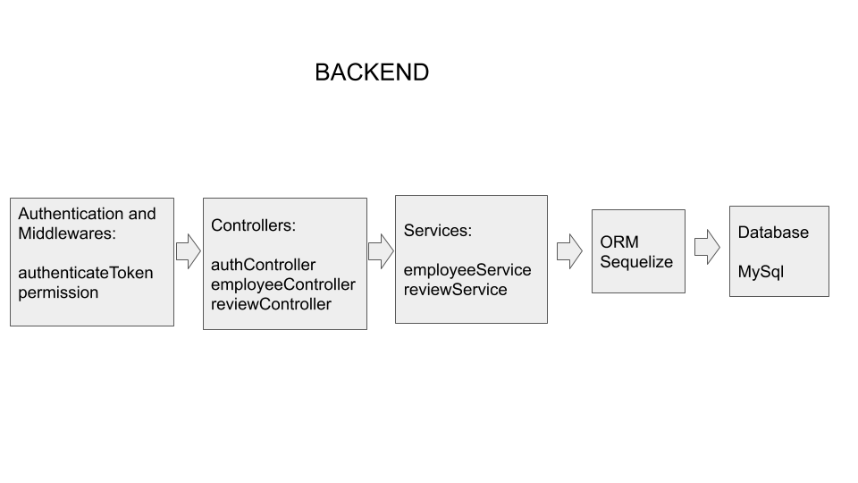
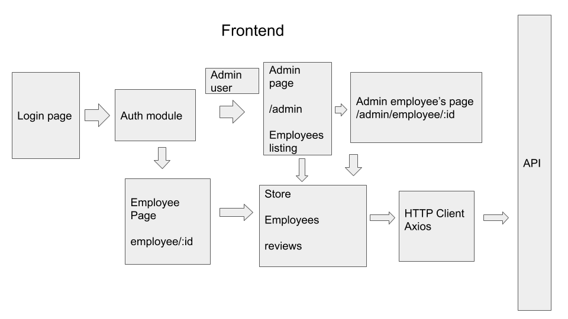

# Project setup

login url:

```
127.0.0.1:3000/login
```

## Prerequisites

### Environment variables

#### Development Backend

Create a .env variable at the root's folder project:

Example:

```
NODE_ENV=development
HOST=127.0.0.1
PORT=5000
DB_HOST=sql12.freesqldatabase.com
DB_NAME=YOUR_DB_NAME
DB_USERNAME=YOUR_DB_USERNAME
DB_PASSWORD=YOUR_DB_PASSWORD
DB_DIALECT=mysql
TOKEN_SECRET=WQIMlEz1bUlYFs9MQvCc3IW21ZpKBNJ4
```

#### Test environment

Create a .env.test variable at the root's folder project:

```
NODE_ENV=test
HOST=127.0.0.1
PORT=5000
DB_USERNAME=root
DB_PASSWORD=null
DB_NAME=database_development
DB_DIALECT=sqlite
DB_STORAGE=./tests/database.sqlite
```

#### Development Frontend

Create a .env variable at the web's folder:

```
BASE_URL=http://localhost:5000/api
```

#### [Node](https://nodejs.org/en/) 12.18.0+

## Backend

### Database migration

Create a mysql database and configure the .env file with the database information as commented previously.

```bash
# install dependencies
$ npm install

# At /api folder run migration:
$ npx sequelize-cli db:migrate

# At /api folder populate the database with users:
$ npx sequelize-cli db:seed:all

# Run tests:
$ npm run tests

# Run development server:
$ npm run dev
```

## Frontend

### Build Setup

```bash
# install dependencies
$ npm install

# serve with hot reload at localhost:3000
$ npm run dev
```

## Users's example

After populating the database there will be available users to login:

### Admin user:

```
email: admin@admin.com
password: admin
```

### Standard employee:

```
email: dgrindley3@hao123.com
password: kbfFtT
```

# Design and tecnologies

## Backend

**DATABASE:** MySql for development and SQLITE for testing database

**ORM:** [Sequelize](https://sequelize.org/) is a promise-based Node.js ORM for Postgres, MySQL, MariaDB, SQLite and Microsoft SQL Server. It features solid transaction support, relations, eager and lazy loading, read replication and more.

**WEB FRAMEWORK:** [Express](https://expressjs.com/)

**Testing framework:** [Jest](https://jestjs.io/)



**database** folder: migrations, table modeling, seeders

**controllers**: authController, employeeController, reviewController

**middlewares**: authenticateToken (verify Authorization header and token JWT), permission (Verify if user is admin to limit access to API's)

**routes**: routing

**services**: employeeService (Handle business logic and database calls regarding to employee information) and reviewService (Handle business logic and database calls regarding to review information)

**tests**: Unit service tests

## Frontend

**Frontend framework:** [Nuxtjs](https://nuxtjs.org/) Vue Framework

**Component framework:** [Vuetify](https://vuetifyjs.com) Material Design Component Framework

**HTTP library:** [Axios](https://axios.nuxtjs.org/)

**Auth module:** [Auth Module](https://auth.nuxtjs.org/)



# Assumptions

## **Admin user**

After successfully logged in user admin will be redirected to employee management where it will be possible to create a new employee, update any information such as name, position, email, and password.

There will not be a sign-up page. Only admin user can register new employees.

Admin user can assign a new reviewer to any employee with blank feedback.

## **Standard employee**

After successfully logged in, the standard employee will be able to see all pending reviews that required feedback.

Once submitted the review will not be seen in the datatable.

# Full Stack Developer Challenge

This is an interview challengs. Please feel free to fork. Pull Requests will be ignored.

## Requirements

Design a web application that allows employees to submit feedback toward each other's performance review.

_Partial solutions are acceptable._ It is not necessary to submit a complete solution that implements every requirement.

### Admin view

- Add/remove/update/view employees
- Add/update/view performance reviews
- Assign employees to participate in another employee's performance review

### Employee view

- List of performance reviews requiring feedback
- Submit feedback

## Challenge Scope

- High level description of design and technologies used
- Server side API (using a programming language and/or framework of your choice)
  - Implementation of at least 3 API calls
  - Most full stack web developers at PayPay currently use Java, Ruby on Rails, or Node.js on the server(with MySQL for the database), but feel free to use other tech if you prefer
- Web app
  - Implementation of 2-5 web pages using a modern web framework (e.g. React or Angular) that talks to server side
    - This should integrate with your API, but it's fine to use static responses for some of it
- Document all assumptions made
- Complete solutions aren't required, but what you do submit needs to run.

## How to complete this challenge

- Fork this repo in github
- Complete the design and code as defined to the best of your abilities
- Place notes in your code to help with clarity where appropriate. Make it readable enough to present to the PayPay interview team
- Complete your work in your own github repo and send the results to us and/or present them during your interview

## What are we looking for? What does this prove?

- Assumptions you make given limited requirements
- Technology and design choices
- Identify areas of your strengths
